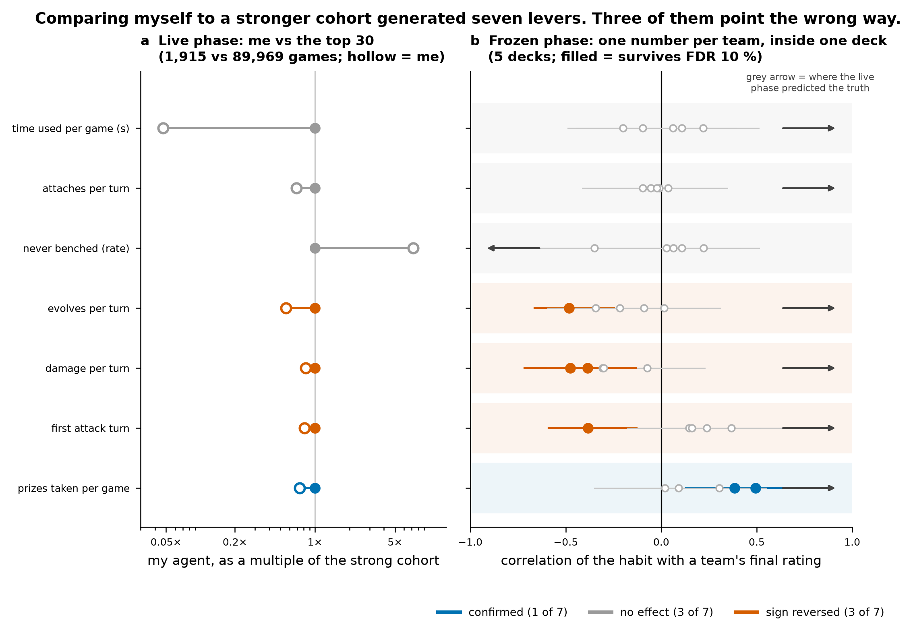

# Learning from a frozen arena

Process mining over 66,061 recorded games from a trading-card-game AI competition (2026).
Entrant **Collatz conjecture** — final rating 636.5, rank 1,058 of 1,604.

Repository: <https://github.com/jg-codes/ptcg-frozen-arena>

**The finding.** During the competition I improved my agent the way most entrants do: compare its
behaviour against the strongest cohort, then close the gaps. That comparison produced seven
behavioural "levers". When the ladder froze and 1,604 fixed agents played 66,061 games against each
other, those levers could finally be tested properly — one number per entrant, inside one deck
archetype, so the archetype, the era and the opponent field are held constant.

**One lever of seven survived. Three showed no effect. Three had the wrong sign.**



A cross-population comparison measures consequences alongside causes and cannot separate them.
Damage per turn is not a behaviour strong players choose; it is what happens when you attack every
turn for whatever value is available instead of developing the board and converting once. And the
habit most strongly associated with rating — retreating the active unit when it is legal — was
absent from the comparison entirely, because the agent's search leaf valued a retreat at exactly
zero.

Full argument: **[writeup/writeup.md](writeup/writeup.md)** (~2,000 words, 9 figures).

## What is here

| Path | Contents |
|---|---|
| `writeup/` | The essay and its nine figures. |
| `analysis/` | Mining scripts that turn the competition's replay episodes into the tables below. Standard library only. |
| `data/` | Derived tables: per-entrant ratings (pseudonymised), the full 696-test habit screen, the multi-turn screen, matchup residuals, and the shipped agent's flag enumeration. |
| `agent/` | The two agent modules as submitted on freeze day: a determinized-search agent and its heuristic action-selection layer. |

## Reproducing

The scripts read the competition's own episode databases (`episodes.db`, `epmeta.sqlite`), built from
the public replay datasets; those are not redistributed here. Paths and the date window are read from
the environment, so nothing needs editing:

```bash
export PTCG_HOME=~/ptcg          # directory holding episodes.db and epmeta.sqlite
export PTCG_D0=2026-08-17        # frozen-tournament window
export PTCG_D1=2026-08-30

python analysis/mine_tournament.py    # per-game and per-entrant tables, decision aggregates, prize tempo
python analysis/mine_team_stats.py    # per-entrant decision counters  -> team_stats.json
python analysis/mine_multiturn.py     # turn-pair sequences (development turn -> next turn)
python analysis/mine_first_player.py  # first-player advantage and mirror matches

python analysis/screen_elo_signal.py --team-stats team_stats.json --teams teams.csv
```

The four miners are standard library only. `screen_elo_signal.py` is the test behind the headline
claim and needs `pip install -r requirements.txt`. Each script writes its outputs to the working
directory.

**What is not included.** The plotting code for the nine figures is not in this repository: those
scripts read the full per-game table (~24 MB, regenerable with `mine_tournament.py`) rather than the
small summaries published under `data/`, so shipping them without that table would give you code that
cannot run. The figures are provided as PNGs, and every number in them is in `data/` or recomputable
from the scripts above. `agent/` is reference code and is not runnable standalone — see
[agent/README.md](agent/README.md).

## Method notes

- **The unit of analysis is the entrant, not the game.** The top-ranked entrant played 2,049 games;
  pooling by tier lets one agent speak for a whole tier. One pooled contrast here (attacking directly
  out of an ability, 13 % vs 7.5 %) looks like a technique and dies under a per-entrant test. It is
  kept in the writeup as a warning.
- **Turns are segmented at the turn-ending decision** (attack or end-of-turn), because the ingest
  pipeline discards turn-start log events. Activities are recovered from the option-type codes in the
  decision log, giving a directly-follows graph per archetype and tier.
- **Corpus caveat.** The competition publishes top replays per day, so the corpus over-weights the
  upper ladder. 259 entrants have ≥30 games and are ranked here.
- **Correlational, not causal.** The screen is a cross-sectional association test on a frozen field.
  It generates well-powered hypotheses; it manipulates nothing.
- **Flag count.** `data/shipped_agent_flag_enumeration.txt` is derived with `ast.parse`, not grep:
  89 module-level boolean switches on freeze day, 4 on. A grep pattern of the form `^NAME = value`
  undercounts by 7, because several assignments are column-aligned.
- **A fixed bug, disclosed.** The screen originally guarded degenerate features with an exact
  `std == 0` test, which a rate like `200/700` slips past at std ≈ 1e-16; the resulting NaN p-value
  would propagate through Benjamini-Hochberg and blank every `q`. The published table was verified
  unaffected (0 NaNs in 696 rows) and the guard is now tolerance-based. See
  [data/README.md](data/README.md).

## Licence

Two licences, by directory:

- **Code** — `analysis/`, `agent/`: MIT, full text in [LICENSE](LICENSE).
- **Essay and figures** — `writeup/`, and the tables in `data/`: Creative Commons Attribution 4.0
  International (CC BY 4.0), full text in [LICENSE-CC-BY-4.0.txt](LICENSE-CC-BY-4.0.txt).

Own drawings only; no game artwork is reproduced. Card and character names appear in the writeup for
identification only and remain the property of their respective owners. No competing entrant is
named anywhere in this repository: `data/frozen_tournament_teams.csv` carries rank-ordered
pseudonyms, and entrants are discussed only by rank or archetype.

Prose and code developed with agentic AI assistance; all numbers are computed from the competition's
official episode datasets.
