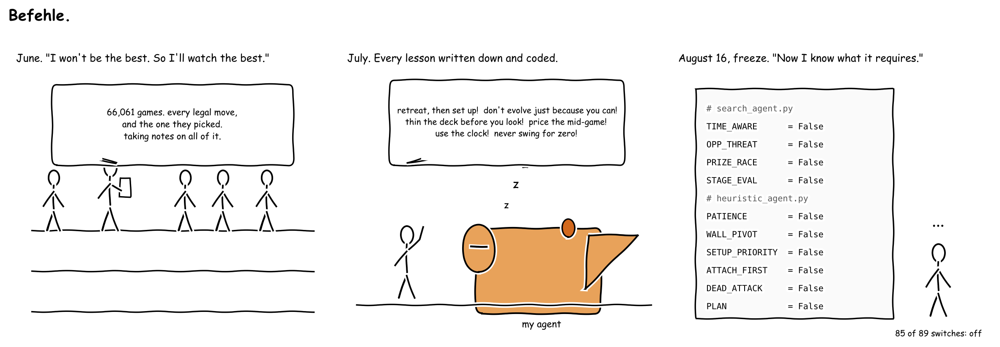
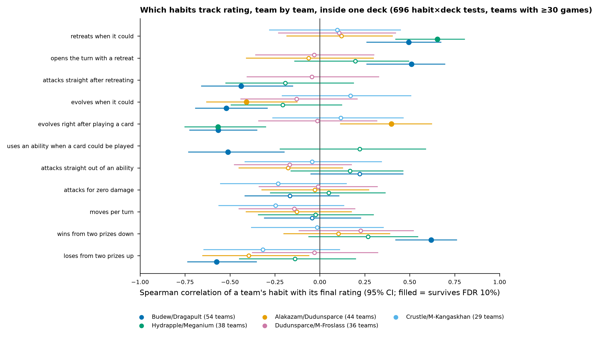
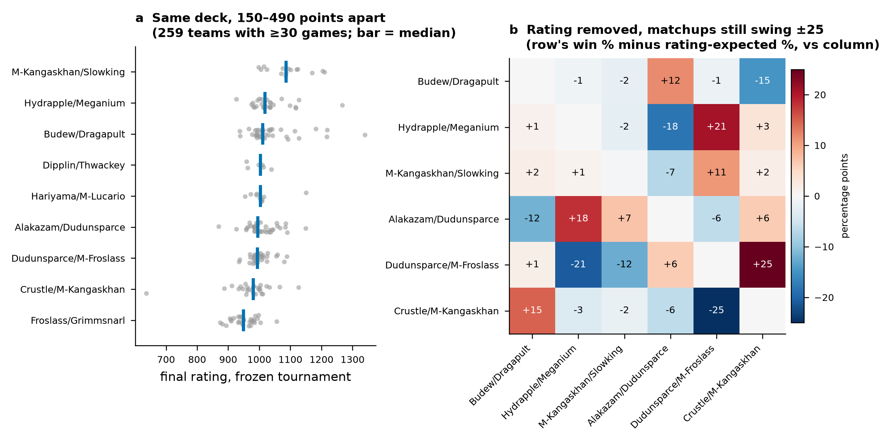
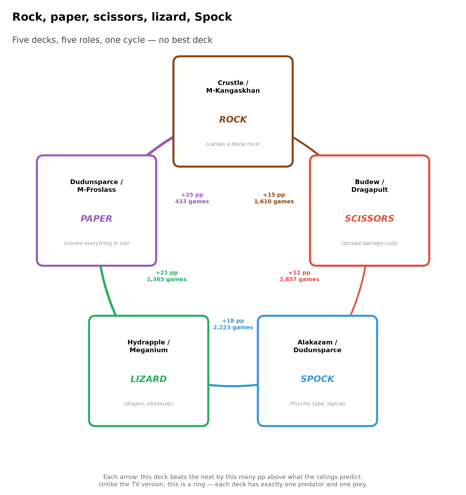
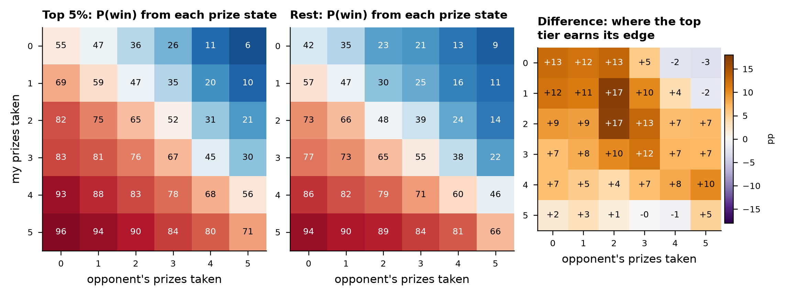
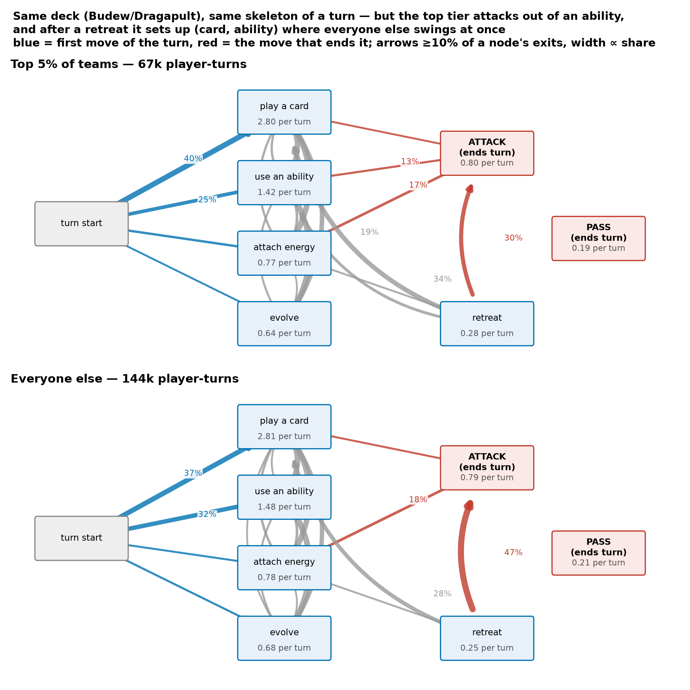
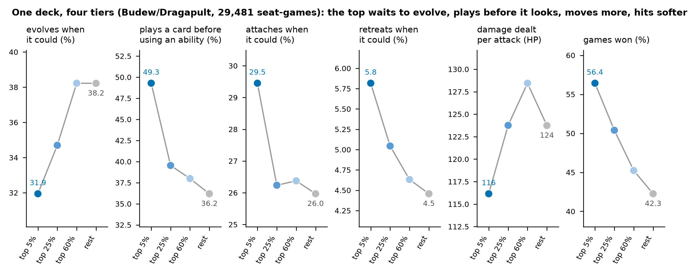
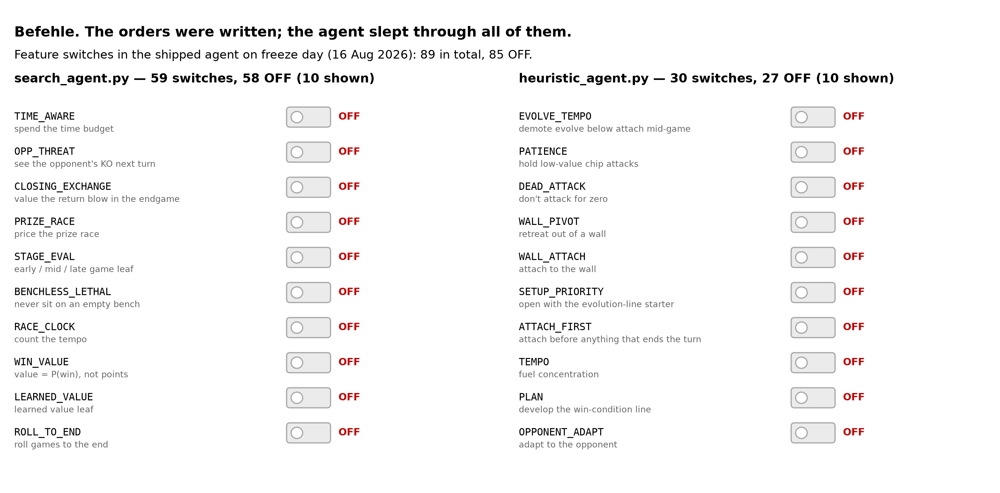

# I wanted to be the best. So I sat down and watched the best.

*Team "Collatz conjecture": one person, one CPU server, no GPU. Final rating 636.5, rank 1,058 of 1,604. Every number is computed from the official replay episodes.*

## June: a seat in the stands

**The agent.** Determinized search — sample the hidden cards, search each world a few plies, vote — with a hand-written evaluation: prize difference times a thousand, HP difference, small credits for development. No neural network, no RL, no GPU. The bet: hidden information rewards breadth of sampling over depth of search, and a cheap, honest leaf beats a learned one at my scale. Half of it held.

**The deck.** Crustle / Mega Kangaskhan ex. The plan fits on a napkin: survive with a wall, close with a tank. Crustle's Mysterious Rock Inn prevents all damage from the opponent's Pokémon ex — and only from those, but that is where this format keeps most of its win conditions, so an entire class of attacker is locked out. Superb Scissors hits back for 120, unaffected by effects on the opponent's Active. Dwebble's Ascension puts the wall down for one energy, so the lock can arrive on turn one. Behind it, Mega Kangaskhan ex: 300 HP on a Basic, drawing two cards a turn from the Active Spot, closing with Rapid-Fire Combo for 200 and up. The rest finds the pieces (Poffin, Hilda, Lillie), keeps a wall with retreat cost three mobile (Switch, Jumbo Ice Cream), and taxes the opponent (Xerosic, Battle Cage). It was the most-played variant among 153,087 top-100 decklists. The sixty cards were never the problem.

**Four hypotheses, four nulls.** Behaviour cloning on 45,742 expert decisions agreed with them on 28 % of moves; my untrained heuristic managed 31 %. A learned value function (AUC 0.73) made the agent *worse* as a search leaf — minus 0.07 win rate — so I trained a better one: AUC 0.96, costing minus 0.24. Search does not sample states at random; it hunts for the ones where your model is confidently wrong. Deeper search changed nothing measurable, and switching decks cost rating, more the further I strayed from my list.

And the ladder could not referee any of it. Byte-identical bundles landed 65 rating points apart — not different agents, the same file twice. With that much noise a co-shipped pair could only resolve a gap larger than about 150 points.

## July: the method that felt rigorous

If the ladder cannot judge a change, judge the *player*. So I built the comparison every improving competitor builds: take the strongest teams, take myself, measure the same behaviours in both populations, read off the gaps. 1,915 of my games against 89,969 from the top thirty.

It produced seven levers, none of them subtle. I used 1.9 seconds of a 600-second budget where they used 40.3 — a twenty-one-fold compute gap. I attached 31 % less energy per turn, evolved 44 % less, dealt 17 % less damage, took a whole prize fewer, attacked a full turn earlier off a thinner board, and failed to bench a second Pokémon seven times as often. That last had the strongest loss signature on record: when it fired, I won 24 % of the time.

Seven levers, each pointing somewhere. I wrote a function for every one. This is the part of the campaign I was proudest of, and the part I now think was wrong — not in its arithmetic, in its design.

## August 16: the frozen arena

On 16 August the ladder froze. For the next two weeks 1,604 agents that could no longer change a line of code played 66,061 games against each other, and every game recorded the complete legal menu at each decision and the option taken: what strong players did, and what they *declined to do*.

A frozen field permits a test the live ladder cannot. Each team is now a fixed policy with a fixed rating, so I can take one number per team, hold the archetype constant, and ask whether a habit tracks rating across pilots of the same sixty cards. That removes the deck, the era and the opponent field in one move. I ranked the 259 teams with at least 30 games, ran 696 habit-by-deck tests at a 10 % false-discovery rate, and re-checked every survivor with the leader removed.

Then I put my seven live-phase levers through it.

## The two phases disagree, and the disagreement has a shape

One lever of seven survived. Three showed no effect at all. Three had the **wrong sign**.

Time used: a twenty-one-fold gap in the population comparison; per-team the correlation runs from −0.20 to +0.22 across five decks, nothing significant. Attaches per turn: nothing. Failing to bench: nothing, so it was my defect rather than a discriminator among strong pilots.

The reversals are the interesting part. Evolving more often was my clearest lever; inside Budew/Dragapult it correlates **−0.48** with rating across 54 teams. Dealing more damage per turn: **−0.39** there, **−0.48** in Crustle. Attacking later: the top tier of Budew pilots attacks *earlier*, **−0.38**.

Why? A population comparison measures *consequences* alongside causes and cannot tell them apart. Damage per turn is not something strong pilots do; it is what happens to you when you swing every turn for whatever is available instead of setting up and killing once. Evolving whenever possible is not tempo, it is burning Drakloak's Recon Directive — a card every turn — for a body you did not need yet. The top thirty used more clock because search depth is one of a hundred things that differ between them and me; hold the deck fixed and the clock stops mattering.

And the habit most strongly associated with rating across decks is the one the live comparison never contained. Retreating when it is legal: **+0.65** in Hydrapple/Meganium, **+0.49** in Budew/Dragapult — two survivors of 696 tests at a 10 % false-discovery rate, which is a screen, not an experiment. This is still cross-sectional — strong pilots may retreat more *because* they are ahead — so it is a hypothesis for a controlled test, not a proven cause. But it is a hypothesis I could never have formed: my search leaf scored a retreat at exactly zero, since it changes no prizes and no hit points. As far as my agent was concerned, retreating never happened.

The one confirmed lever, prizes taken, is the win condition restated.

**The generalisation.** Comparing yourself to better players is a hypothesis *generator* with a systematic bias, not a test. Anyone benchmarking a card-game agent against a stronger cohort — which is almost everyone — should expect roughly half their levers to be confounded and a minority inverted. The fix is cheap, and this competition made it possible: freeze the field, then test one number per team inside one deck.

## What the frozen corpus does say

**The deck is a third of the story.** Archetype explains 36 % of rating variance; the other 64 % is the pilot. Inside one archetype teams finish 150 to 490 points apart, while the nine most-played decks have medians within 137 points. The worst pilot holding the champion's exact sixty cards finishes 400 points behind.

**There is no best deck; there is a ring.** Strip the ratings out and residual win rates average 6 percentage points, reach 25, and close a cycle: Crustle beats Budew by 15 more than predicted, Budew beats Alakazam by 12, Alakazam beats Hydrapple by 18, Hydrapple beats Dudunsparce/Froslass by 21, and Dudunsparce/Froslass beats Crustle by 25 — which is how a wall dies. No edge rests on fewer than 433 games. Per-team matchup luck spans only −8 to +5 points and predicts no rating (p = 0.39): over thirty games the ring is fair. The coin is less so — going first wins 52.5 %, about fifteen points before a card is played.

**Skill lives in the middle of the prize race.** At the extremes it is irrelevant — down 0–5, 6 % against 9 %; up 5–0, 96 % against 94 %. Down 1–2 the top 5 % still win 47 % against 30 %; tied 2–2, 65 % against 48 %; from two prizes behind they come back 30 % against 20 %. My leaf priced every prize the same.

**Ordering beats volume.** Within one deck the top tier plays a card before using an ability (ρ = −0.51 for the reverse), retreats to set up rather than to swing (attacking straight after a retreat, −0.44), and cashes its quiet turns in: a quiet attach-and-pass followed by a full turn with a retreat and an attack correlates **+0.68** with rating, while two quiet turns back to back correlate **−0.82**. A set-up turn is a promissory note; what matters is whether the next turn honours it.

**One trap, kept deliberately.** Pooled by tier, the best Budew pilots attack straight out of an ability far more often: 13 % against 7.5 %. It looks like a technique; I nearly wrote it up as one. But the leader alone played 2,049 games, and pooling lets one obsessive agent speak for a tier. One number per team: ρ = 0.22, dead under correction. The same error as the live phase, caught this time.

## Why I finished 1,058th

Here is the part that hurts. I had written most of these lessons down already — not in a notebook, in code. By freeze day the agent carried 89 feature switches. Eighty-five were off.

Each had been written, tested offline, and left at `False` pending a verdict from a ladder that could not deliver one. I had built a chain of command in which the order could only come from an oracle that does not exist. It gets worse: until 4 August the bundler silently fell back to a stale deck list, so eight challengers shipped an extinct deck and every A/B result measured the deck, not the feature.

Over 1,063 frozen-tournament games my agent held a 50.8 % win rate at its own level, on one deck and two submissions — consistently mediocre, which is at least reproducible. Against the other 28 ranked Crustle pilots it thought 331 seconds a game against their median of 15 and did less with it: 3.9 attacks against 4.6, 1.9 prizes against 2.6, 60 % of turns ending without an attack, 21 % of attacks dealing zero damage against their 13.8 %. Deep search on a flat leaf does not produce aggression. It produces a very careful agent that passes.

## What I would build, and what I would measure

Price the mid-game from the empirical prize table. Make retreat a live branch instead of a move worth zero. Set evolution timing per deck. Credit a quiet turn only against the turn that follows. None of it is a new architecture — all of it is what the frozen field would have told me in week one, had I asked it instead of the ladder. And then switched on.

And the deck? Knowing exactly who waits in the arena, I would bring Alakazam/Dudunsparce: projected onto the frozen field's opponent mix it holds the best cycle edge at every rating band above 1,000.

Which is the weakest sentence in this report, and I would rather be the one who says so. The projection barely reorders the ranking between bands. Archetype is 36 % of the variance; the pilot is the other 64 %. Alakazam's own pilots finished sixth of nine on median rating. And the moment anyone acts on the recommendation the ring turns, and the deck that beats Alakazam becomes the deck everyone brings: not a flaw in the analysis but the clearest evidence in it that the format is balanced.

So: bring the deck you can pilot. Then spend the eight weeks on the pilot, and switch the orders on.

---

*Prose and code developed with agentic AI assistance; all numbers computed from the official episode datasets. Own drawings only; no card imagery. Pokémon and card names are used for identification only. Code: jg-codes/ptcg-frozen-arena.*
